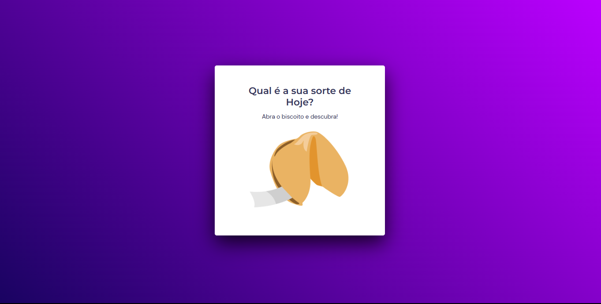
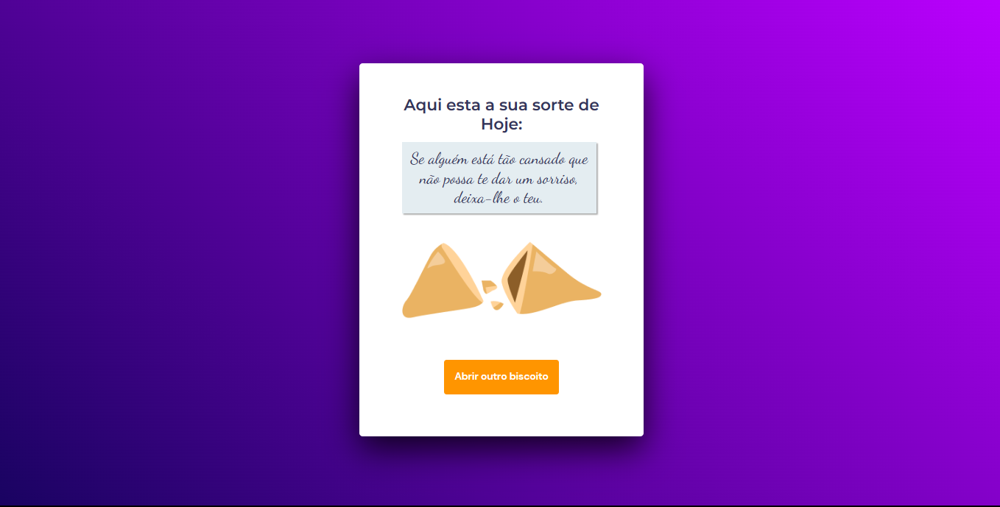

<h1 align="center">Biscoito da sorte</h1>

Desafio proposto pela equipe de instrutores da Rocketseat para o EXPLORER, para uma melhor compreensão do HTML e CSS.
 

  <a href="#-tecnologias">Tecnologias</a>&nbsp;&nbsp;&nbsp;|&nbsp;&nbsp;&nbsp;
  <a href="#-projeto">Projeto</a>&nbsp;&nbsp;&nbsp;|&nbsp;&nbsp;&nbsp;
  <a href="#-layout">Layout</a>&nbsp;&nbsp;&nbsp;|&nbsp;&nbsp;&nbsp;
  <a href="#memo-licença">Licença</a>

  

 

  

---

  

## 🚀 Tecnologias

Esse projeto foi desenvolvido com as seguintes tecnologias:

- HTML
- CSS
- javaScript
- Git e Github

## 💻 Project

O projeto biscoito da sorte foi desenvolvido para estudar o uso do HTML, CSS e javaScript. Neste projeto, construimos uma aplicação que ao passar o mause por cima o biscoito se agita e ao clicar no biscoito o mesmo se abre e sai uma mensagem do seu interior. Entre os temas mais comuns estão:

- Estrutura de dados HTML;
- Animações com CSS;
- Funções no Javascript;
- Manipulação da DOM;
- Biblioteca JS Math();
- Funções *callback*;
- Arrays.

## Demonstração

<video width="800" height="240" controls>
  <source src="./video/Biscoito_da_sorte.mp4" type="video/mp4">
  Seu navegador não suporta o elemento de vídeo.
</video>

## 🔖 Layout

Você pode visualizar o layout do projeto através [DESSE LINK](https://www.figma.com/community/file/1182751789348533739). É necessário ter conta no [Figma](https://figma.com) para acessá-lo.

## 🔗 Links
 

## 📝 Licença

 
Esse projeto está sob a licença MIT.

---
Feito com ♥ by Rocketseat 👋 [Participe da nossa comunidade!](https://discord.gg/rocketseat)

# Desafio 1 -Stage 5-Explorer-Rocketseat